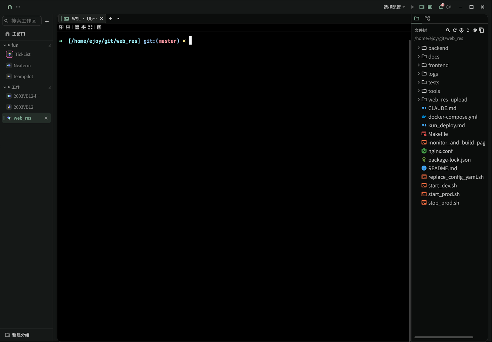
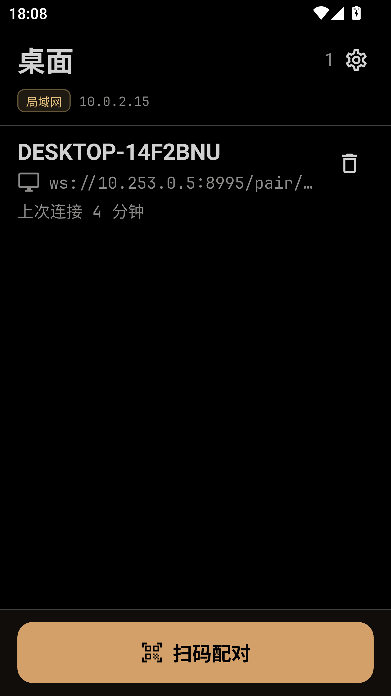

# TeamPilot

> Fork 自 [hhoao/teampilot](https://github.com/hhoao/teampilot/)。

[开发指南](docs/DEVELOPMENT.md) · 架构与 AI 约定见 [AGENTS.md](AGENTS.md)

**TeamPilot** 是一个面向开发者的桌面客户端：以**工作区**为中心，把仓库目录、内嵌**终端会话**、**分屏复用**和一个轻量**内置 IDE**（文件树、编辑器、Git、worktree）整合到同一个窗口里。会话标签是**普通的交互式终端**——桌面端直接以本机 PTY 打开，或通过 **SSH** 连接远端主机。你可以在终端里运行任何命令行工具，包括各类 AI Agent CLI（Claude Code、Codex、opencode、cursor、flashskyai 等）。

TeamPilot 不会替你启动或编排这些 CLI；它只负责把它们跑起来的环境组织好。此外还内置了 **Agent 状态通知**：Claude Code / Qoder / Codex / opencode / flashskyai 通过 hook 上报，cursor 通过窗口标题探测——Agent 结束一轮、被打断或需要授权时弹出系统通知。**手机**可通过配对远程操作桌面终端：实时镜像、接管输入、上传文件、语音输入、接收通知。

| 桌面端 | 移动端（配对） |
|:---:|:---:|
|  |  |

## 核心能力

| 能力 | 说明 |
|------|------|
| **工作区** | 把一个或多个仓库目录组织为工作区；左侧侧栏管理、分组、搜索，多个工作区以标签页并排打开。 |
| **终端复用** | 一个标签内任意分屏、五种布局预设、pane 焦点与最大化、终端输出内搜索。 |
| **内置 IDE** | 文件树、多标签代码编辑器、VS Code 风格的 Git 源代码管理、git worktree，与终端共享同一工作目录。 |
| **终端主题** | 内置 23 套主题，支持导入 Alacritty TOML / Ghostty 主题文件，可逐色槽自定义。 |
| **命令跟踪** | OSC 133 shell 集成命令日志、命令历史选择器，密钥自动脱敏。 |
| **Agent 状态通知** | Agent 结束一轮 / 被打断 / 等待授权时发系统通知，支持推送手机与 Bark。 |
| **通知中心** | 标题栏铃铛汇总终端 OSC 通知（OSC 9/99/777）与 Agent 通知，点击直达对应工作区。 |
| **手机配对** | 扫码配对、端到端加密；镜像交互、接管输入、图片/视频上传、语音输入、手机上看 Git。 |
| **多机运行** | 应用主目录可运行在**本机**、**WSL** 发行版或某个 **SSH** 主机上（设备级设置）。 |

## 终端复用

### 分屏与布局

每个终端标签内部是一棵可分裂的 pane 树：

| 能力 | 说明 |
|------|------|
| **拆分** | 布局工具栏或右键菜单「向右拆分 / 向下拆分」；快捷键 `Ctrl/⌘+Shift+\`、`Ctrl/⌘+Shift+D`；分隔条可拖拽调整比例。 |
| **布局预设** | 单屏 / 两列 / 三列 / 2×2 网格 / 主屏 + 堆叠五种。应用预设**不杀死任何运行中的 pane**——pane 数超出槽位时堆叠进最后一槽。 |
| **焦点** | 点击聚焦；`Alt+Shift+方向键` 按方向跳转；`Ctrl/⌘+Alt+[` / `]` 上一个/下一个；`Ctrl/⌘+Shift+Z` 最大化/还原当前 pane；`Ctrl/⌘+Shift+Q` 关闭 pane。 |
| **搜索** | `Ctrl+Shift+F` 打开终端输出内搜索（`F3` / `Shift+F3` 跳转结果）。 |

所有命令都可在「设置 → 键盘快捷键」里重新绑定、导入导出；`Ctrl/⌘+/` 打开快捷键速查表。

### 终端主题

- 内置 **23 套**主题（12 深 11 浅），设置 → 布局页选择，带实时预览。
- **导入**第三方主题文件：Alacritty TOML（`[colors.*]`）与 Ghostty（`palette = N=…`）两种格式，自动嗅探，缺失色槽自动派生。
- 自定义：整体方案之外可开关「自定义颜色」，逐色槽覆盖前景/背景/光标/选区。

### 命令日志与历史

- **OSC 133 命令跟踪**：识别 shell 集成的提示符/命令边界标记，记录每条命令、退出码与耗时；未装 shell 集成的 pane 用「提交过的输入行」兜底。包含密钥脱敏——命令行里的 token/password 参数不会进日志。
- **命令日志窗口**：`Ctrl/⌘+Shift+L`，按 pane 查看运行中/历史命令列表。
- **命令历史选择器**：`Ctrl/⌘+Shift+H`，模糊搜索当前 pane 的历史命令；`Enter` 直接执行，`Shift+Enter` 插入输入位置。

## 工作区与内置 IDE

同一个窗口里就能完成常见的仓库浏览、改文件、看 diff、提交 Git，并与内嵌终端并排使用。工作区侧栏按 **worktree** 分组会话；右侧工具栏提供文件树、源代码管理等面板，减少在 IDE 与终端之间来回切换。全局搜索对话框同时检索会话标题与仓库内文件内容。

### Git Worktree

在绑定 Git 仓库的工作区里，TeamPilot 原生支持 **git worktree** 工作流（桌面本机 / WSL / SSH 主机上的 git 均可）：

| 能力 | 说明 |
|------|------|
| **按分支分组** | 侧栏会话按 worktree 折叠分组；选中某一分支即切换当前工作目录，文件树与 Git 面板随之跟随。 |
| **创建 worktree** | 从主仓库派生新分支或检出已有分支；目录默认落在应用数据下的 `worktrees/<仓库名>/<分支>`，也可在对话框中调整路径。 |
| **删除 worktree** | 支持强制删除（有未提交改动时）、可选同时删除分支、可选一并删除该 worktree 下的会话。 |
| **一键开会话** | 创建时可勾选「创建后在此开始一个会话」，在新 worktree 里直接打开终端。 |

适合并行开发多个功能分支、或在不影响主工作区的前提下让不同会话各自占用独立检出目录。

### 内置 IDE 能力

右侧工具栏与编辑区提供常见 IDE 能力，与终端共享同一工作目录，磁盘变更会联动刷新文件树与 Git 状态（本机 / WSL 实时监听；SSH 端按时机轮询刷新）：

| 模块 | 能力 |
|------|------|
| **文件树** | 浏览工作区目录；支持多根文件夹（VS Code 式折叠头）、过滤、新建文件/文件夹、复制/剪切/粘贴、重命名、删除、复制路径、用系统应用打开、**定位当前编辑文件**。 |
| **代码编辑器** | 基于 **re-editor** 的多标签内嵌编辑器；从文件树或 Git diff 打开文件，未保存改动有脏标记，关闭前提示保存。 |
| **源代码管理（Git）** | VS Code 风格的变更列表：暂存 / 取消暂存、按文件或目录暂存、放弃更改、分支切换、内联 **diff 视图**（语法高亮与行间导航）、填写提交说明并 **提交**。 |
| **工作区搜索** | 侧栏搜索入口：同时检索会话标题与仓库内文件内容，快速跳转到对应会话或文件。 |

## Agent 状态通知

TeamPilot 会安装一组共享 Agent hook（**附加式**合并进各 CLI 的用户级配置——Claude Code 的 `~/.claude/settings.json`、Qoder 的 `~/.qoder/settings.json`、Codex 的 `~/.codex/hooks.json`——只管理自己的条目，不覆盖你已有的 hook，包括其他工具装的 hook），把 Agent 生命周期事件上报到应用内的本机回环网关；应用匹配到对应会话后，在 Agent **结束一轮、被打断或等待授权**时弹出系统通知——即使窗口在后台，也能及时知道该回到哪个会话。

- **支持的上报源**：Claude Code / Qoder / Codex / opencode / flashskyai 走 hook 协议；cursor 不走 hook，改用窗口标题探测。
- **通知中心**：标题栏铃铛汇总 Agent 通知与终端自己发的 OSC 通知（OSC 9 / 99 kitty / 777），支持已读、清空、点击深链到对应工作区。
- **推送到手机**：配对手机在线时收本地通知；离线可配置 **Bark** 推送（关闭 / 仅无手机连接时推 / 总是推），在「设置 → 会话」配置服务器与设备 Key，可发测试推送。
- SSH 远端主机上的 Agent 同样覆盖：事件经反向隧道送回本机网关。

## 手机配对

手机装同一个应用（Android / iOS），作为桌面的**配对客户端**：自身不运行终端，而是远程操作桌面工作区。配对走局域网，连接**端到端加密**（X25519 密钥交换 + NaCl 加密通道），主机公钥固定防中间人。

### 配对与连接

1. 桌面端：「设置 → Device Pairing」启用后显示二维码 / 配对深链 / 配对码（15 分钟有效、单次使用）。
2. 手机端：扫码（摄像头或相册截图解码）、粘贴深链或手动输入配对码。
3. 首次配对成功后设备记住凭据，之后**自动重连**——断线、切后台回来都会悄悄接上。

### 镜像与接管

- 手机浏览 **分组 → 工作区 → 终端** 树，打开任一面板即可**实时交互镜像**：手机键盘输入直接进桌面 PTY，旋转/软键盘自动同步尺寸；桌面正在休眠的工作区也能从手机现开终端。
- 手机 attach 后桌面端自动**让出**：该面板变只读并显示「手机接管中」横幅，手机离开即恢复。
- 多行输入框：先编辑、后发送，切面板不丢草稿；语音转写与上传路径都插入这里。
- **快捷键条**：Esc / Tab / 方向键（长按重复）/ `^A`–`^_` / F1–F12 / Home/End/PgUp/PgDn 等，Ctrl/Alt 闩锁；按键组可拖拽自定义顺序并持久化。
- 触摸长按选择终端文本 → 复制浮标；快捷键条一键粘贴手机剪贴板。

### 从手机上传文件

在镜像页选择图片或视频，经配对通道**流式**上传（边传边写盘、断点背压）：

| 类型 | 上限 | 格式 |
|------|------|------|
| 图片 | 25 MiB | png / jpg / jpeg / webp / gif / heic |
| 视频 | 512 MiB | mp4 / mov / m4v / 3gp / webm / mkv / avi |

文件落在该机器的**临时目录**（不污染你的工作树 / `git status`），同名自动 `-1`/`-2` 后缀不覆盖；传完后路径自动加引号插入输入框，直接喂给终端里的 Agent。

### 语音输入

镜像页输入框的麦克风按钮：说话转文字插入输入框。三种后端可选——系统本机识别、火山引擎、阿里云 NLS，支持语言选择；云凭证存系统安全存储，配置页可发测试验证。

### 手机上看 Git 与建工作区

- 镜像页导航栏显示变更数徽标；点开是**变更文件列表**（Agent 回合结束自动刷新），点文件看只读 unified diff。
- 会话列表「+」菜单可从手机**新建工作区 / 分组**，目录用远程目录浏览器选择。

### 移动端设置

手机设置页提供外观与语言（主题模式/主题色/语言）、语音输入设置、**调试日志**（写文件开关 + 尾部查看 + 一键复制全部——日志在 Android 私有目录里，这是它离开设备的唯一通道）。

## 安装

在 [GitHub Releases](https://github.com/wujiyu115/cmux/releases) 打开最新版本，按系统下载对应文件（文件名形如 `teampilot-<版本>-…`）。

### Linux

**Debian / Ubuntu（`.deb`，推荐）**

```bash
sudo dpkg -i teampilot-*-linux.deb
# 若提示依赖缺失：
sudo apt install -f
```

安装后从应用菜单启动 **TeamPilot**。卸载：`sudo apt remove teampilot`（包名以 deb 元数据为准）。

**AppImage（免安装）**

```bash
chmod +x teampilot-*-linux.AppImage
./teampilot-*-linux.AppImage
```

需要 `libfuse2`（Ubuntu 22.04+ 常需 `sudo apt install libfuse2`）。若希望写入开始菜单 / Dock，可配合 [AppImageLauncher](https://github.com/TheAssassin/AppImageLauncher)。

桌面端默认在本机以 PTY 直接打开终端会话；也可在「设置 → 会话」中把运行目标改为 **SSH** 远端主机或 **WSL** 发行版。

### macOS

1. 下载 `teampilot-*-macos.dmg`。
2. 打开 DMG，将 **TeamPilot** 拖入「应用程序」。
3. 首次启动若被 Gatekeeper 拦截：「系统设置 → 隐私与安全性」中允许，或右键应用 →「打开」。

### Windows

任选一种安装包（同一 Release 中通常都有）：

| 文件 | 说明 |
|------|------|
| `*-windows-setup.exe` | **推荐**：Inno Setup 安装向导，自动创建快捷方式 |
| `*.msix` | 适用于已启用旁加载 / 企业分发的环境 |
| `*.zip` | 便携包：解压后运行其中的 `TeamPilot.exe`，不写注册表 |

Windows 上可把运行目标设为 **WSL** 发行版，终端与工作目录都会落在 Linux 侧；也可配置 **SSH** 连接远端开发机。

### Android

Android 版是桌面端的**配对客户端**（不运行本机终端）：

1. 根据 CPU 架构下载 `teampilot-*-arm64-v8a.apk`（多数新机型）或 `teampilot-*-armeabi-v7a.apk`。
2. 允许「未知来源」后安装。
3. 与一台运行 TeamPilot 的桌面机器在同一局域网，按上文「手机配对」扫码配对。

iOS 另有未签名 IPA 的手动构建流程（仓库工作流 `build-ios`），需要自备签名。

## 终端

内嵌终端使用 **[flutter_alacritty](https://github.com/hhoao/flutter_alacritty)** — 一个基于 Alacritty 的 Rust 引擎驱动的 Flutter 组件。桌面端通过 `flutter_pty_new` 打开本机 PTY，SSH 会话通过 `dartssh2` 连接远端。

## 从源码构建

安装包由 CI 自动构建；从源码编译见 **[开发指南](docs/DEVELOPMENT.md)**。

## 更多文档

| 文档 | 读者 | 内容 |
|------|------|------|
| [开发指南](docs/DEVELOPMENT.md) | 贡献者 / 维护者 | 环境、本地运行、测试、打包与 CI |
| [AGENTS.md](AGENTS.md) | 贡献者 / AI | 仓库结构、架构约定 |
| [工作区存储布局](docs/workspace-storage-layout.md) | 贡献者 / AI | `<teampilotRoot>` 下的磁盘路径 |

## 致谢

- 文件图标：[Material Icon Theme](https://github.com/material-extensions/vscode-material-icon-theme)（MIT 协议），作者 Philipp Kief / material-extensions。

## 许可证

本项目采用 [GNU Affero General Public License v3.0](LICENSE)。

## 社区

| 渠道 | 链接 |
|------|------|
| **QQ 群** | `1016450915` |
| **Discord** | [加入频道](https://discord.com/channels/1518523215767666719/1518523216912449669) |

欢迎反馈问题、交流用法与贡献想法。
